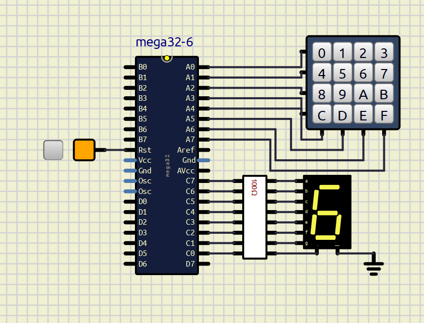

# ATmega32A 4×4 Hexadecimal Keypad Interface

## Overview

This project demonstrates interfacing a 4×4 hexadecimal keypad with an ATmega32A microcontroller using AVR Assembly Language.

The system scans the keypad matrix, detects the pressed key, converts it to a hexadecimal value, and displays the corresponding character on a 7-segment display.

## Features

* AVR Assembly implementation
* 4×4 matrix keypad scanning
* Hexadecimal input (0–F)
* Lookup table-based decoding
* 7-segment display output
* SimulIDE simulation

## Project Structure

```text
code/
 └── main.asm

simulation/
 └── hex_keypad.sim1

images/
 └── hex_keypad.png
```

## Hardware Components

* ATmega32A
* 4×4 Hexadecimal Keypad
* Seven-Segment Display
* Connecting wires

## Working Principle

1. The microcontroller continuously scans the keypad rows.
2. Column inputs are monitored to detect a key press.
3. The pressed key position is identified.
4. A lookup table maps the key to its corresponding 7-segment display pattern.
5. The selected hexadecimal character (0–F) is displayed on the 7-segment display.

## Circuit Diagram



## Building the Project

1. Open the AVR Assembly source file:

   ```text
   code/main.asm
   ```

2. Assemble the program using an AVR assembler such as Microchip Studio (recommended).

3. Load the generated HEX file into the ATmega32A microcontroller in SimulIDE before running the simulation.

## Running the Simulation

### Prerequisites

- SimulIDE installed on your system

### Steps

1. Open the simulation file in SimulIDE:
```text
   simulation/hex_keypad.sim1
```

2. If the microcontroller does not already contain the program:

   - Double-click the ATmega32A microcontroller in SimulIDE.
   - Locate the **Load firmware** field.
   - Load the generated HEX file into the microcontroller.

3. Run the simulation.

4. Press any key on the keypad.

5. Observe the corresponding hexadecimal digit on the 7-segment display.

## Source Code

The AVR Assembly source code is available in:

```text
code/main.asm
```

## Author

Ankita Mandal
